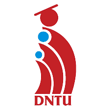

# DNTU IRAST PROJECT - [BETA]

# Introduction
- Welcome to DNTU IRAST, this website displays about products of companies.

# About Us
- Thanks for contributions from:
  - Mr. Lê Chân Thiện Tâm ( Project Manager )
  - Lê Minh Nghĩa
  - Đào Hoàng Nhi 
- We are also proud to collaborate with DONG NAI TECHNOLOGY UNIVERSITY.

# Tools & Technologies
- Frontend Frameworks: We utilize Next.js, React.js, Tailwind CSS, Swiper, and Framer Motion...

- Backend Frameworks: Our server is powered by Node.js and Express.js, with data management supported by SQLite.

- Database: We rely on SQLite to store and manage data efficiently.

- Design and Collaboration: For design and communication, we use tools such as Postman, SQLite Database, and Figma, ensuring that our development process is smooth and collaborative.
